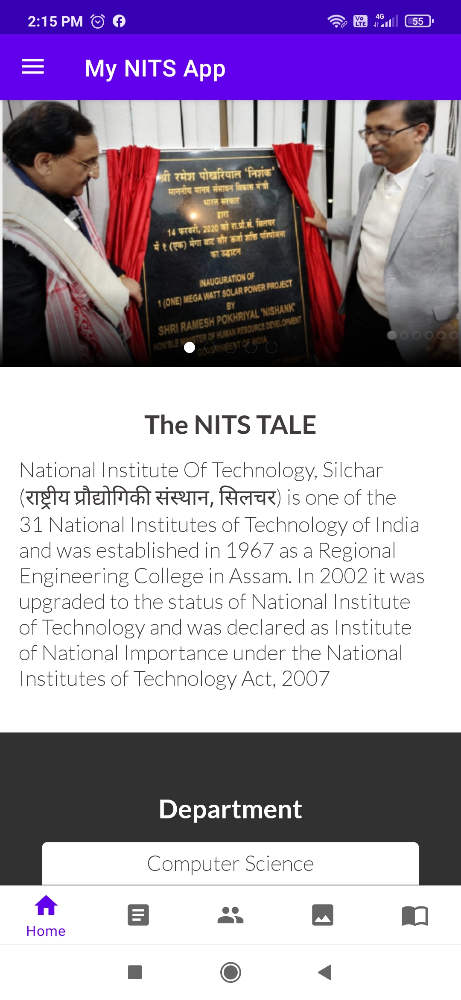

# My-NITS-App
My NITS app is made with love for the students of NIT Silchar. It helps the users to know the college better and also to stay updated with latest developments in the college.

### Features

- Users gets updated information of all the departments and their respective faculty members. 
- User can view various gallery images of various events of the college. 
- Users can also view (in pdf form) and download available Ebooks from the app. 
- Users are constantly updated with the latest notices from the University.
- The app also link users with college You Tube channel, College Website, etc. 
- Google Map intent is used in the app to show users exact location of the college. 

### Tech Stack
Java, xml, Android Studio, Git, Firebase Realtime Database, Firebase Storage.

### Libraries/Dependencies

- Android Jetpack Navigation
- Navigation Drawer
- Bottom Navigation
- Fragments
- Nested RecyclerView
- Android Material Design 
- Glide
- ViewPager, etc.

### Screenshots

  <kbd>
  
  </kbd>
  &ensp; &ensp;
   <kbd>
   
   </kbd>

<h4>&ensp; Home Fragment &ensp;&ensp;||&ensp;&ensp; Latest Notices(Regularly Updated by Admin) </h4>

 
 

  
  

  <kbd>
  
  </kbd>
  &ensp; &ensp;
   <kbd>
   
   </kbd>

<h4>&ensp; Faculties(Regularly Updated by Admin) &ensp;&ensp;||&ensp;&ensp; College Gallery </h4>

 
 

  <kbd>
   
   </kbd>
  &ensp; &ensp;
  <kbd>
   
   </kbd>  

<h4>&ensp;About College Fragment </h4>

 
 

  <kbd>
  
  </kbd>
  &ensp; &ensp;
  
  <kbd>
   
   </kbd>

<h4>&ensp; Navigation Drawer  &ensp;&ensp;||&ensp;&ensp; Available Ebooks(Can be viewed and downloaded by user) </h4>

